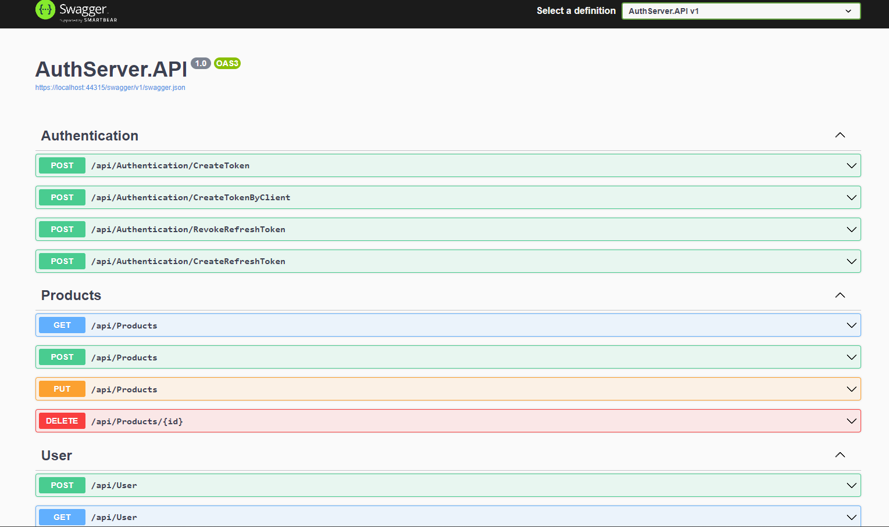
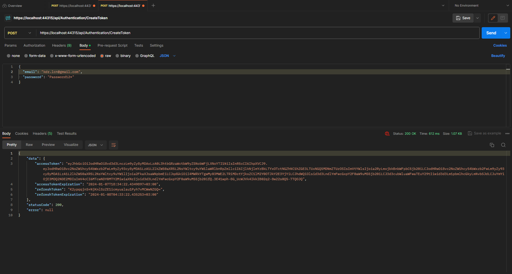
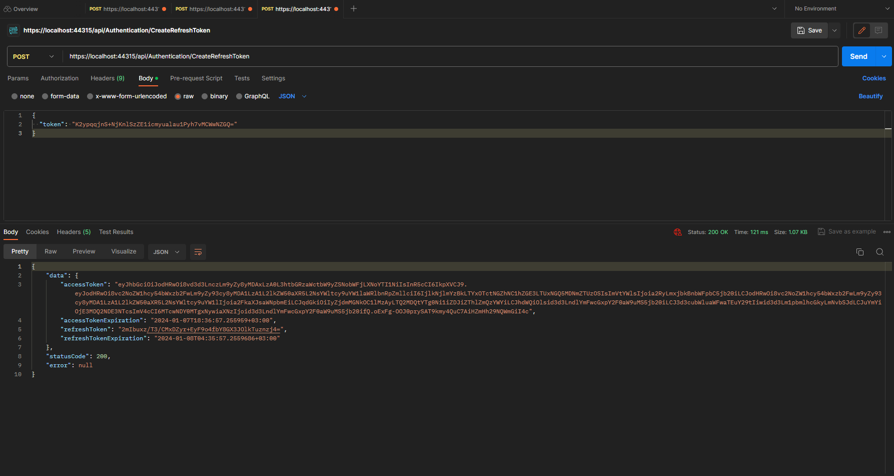
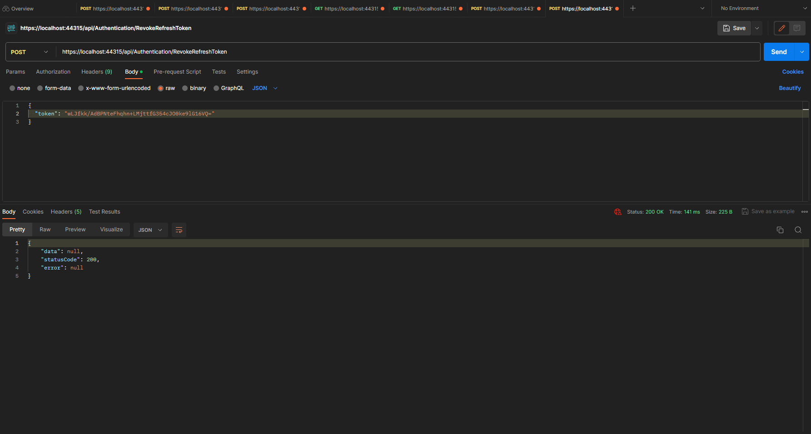
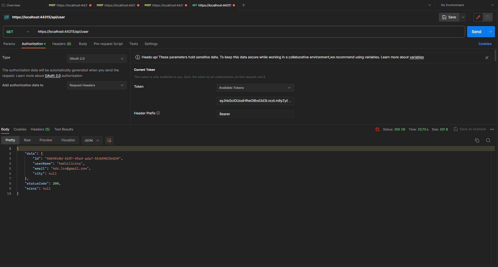
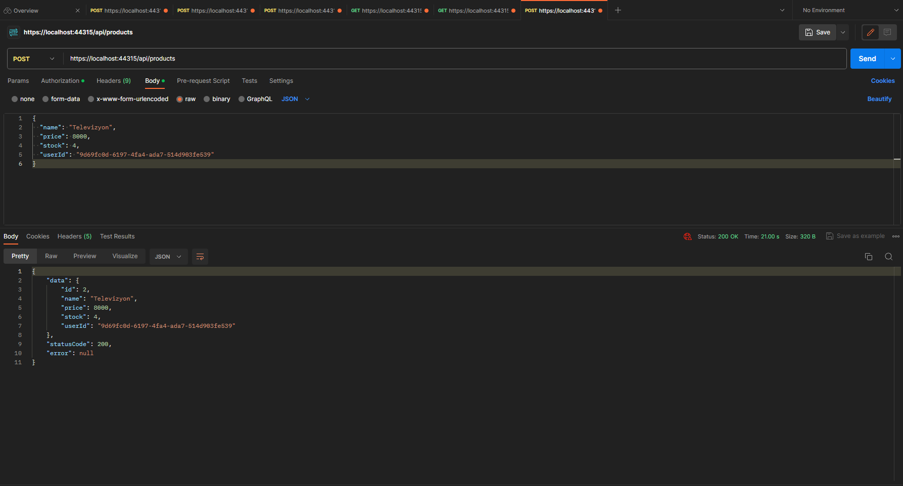
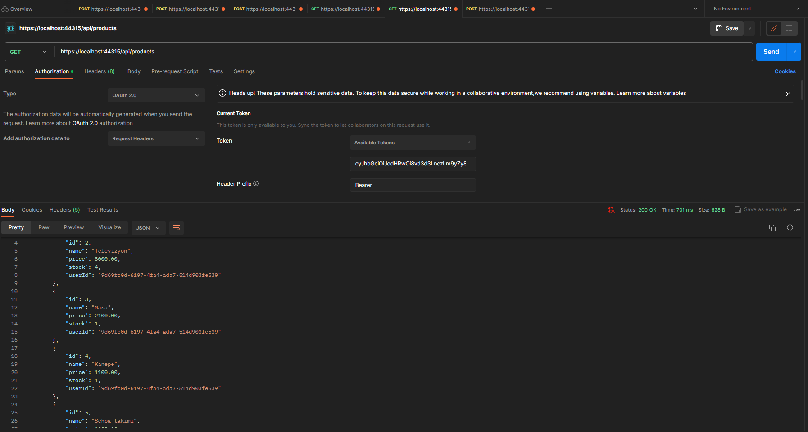
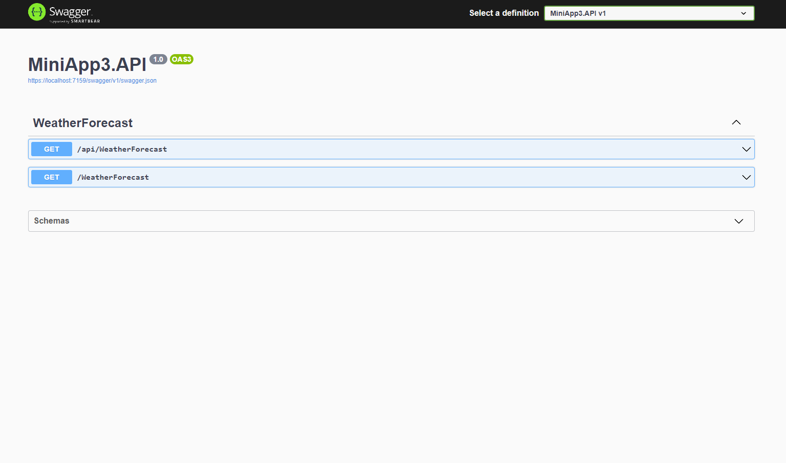
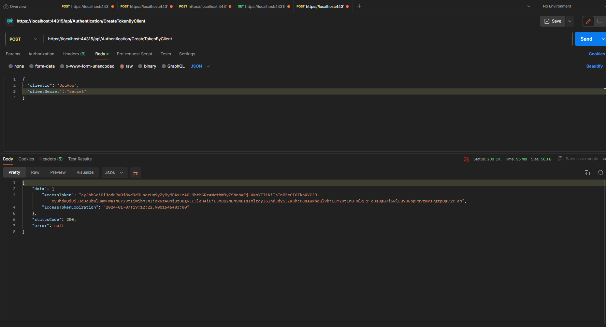
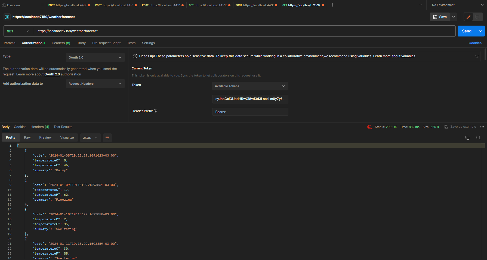

Postman ile birlikte oluşturulan kullanıcı kaydının ardından, gerçekleştirilen Token (Acces ve Refresh) alma işlemleri. //After the user registration created together with Postman, Token retrieval operations (Access and Refresh) are performed.

Refresh Token alma ve Revoke etme süreci. //The process of obtaining and Revoking Refresh Tokens.

Kullanıcının sisteme girişini takip etmek ve güvenliği sağlamak amacıyla kullanılan Token'ın doğrulama süreci, ürünleri kaydetme ve listeleme işlemleri. //The verification process of the Token used to track the user's login to the system and ensure security, the processes of registering and listing products.

Cilent'ların üyelik sistemi olmaksızın Token alma ve izin verilen mini API'nin içeriğine erişebilme süreci. //The process of receiving Tokens without Cilents' membership system and accessing the content of the permitted miniapi. 

