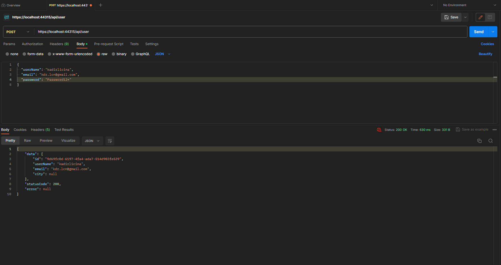

Postman ile birlikte oluşturulan kullanıcı kaydının ardından, gerçekleştirilen Token (Acces ve Refresh) alma işlemleri. // After the user registration created together with Postman, Token retrieval operations (Access and Refresh) are performed.

